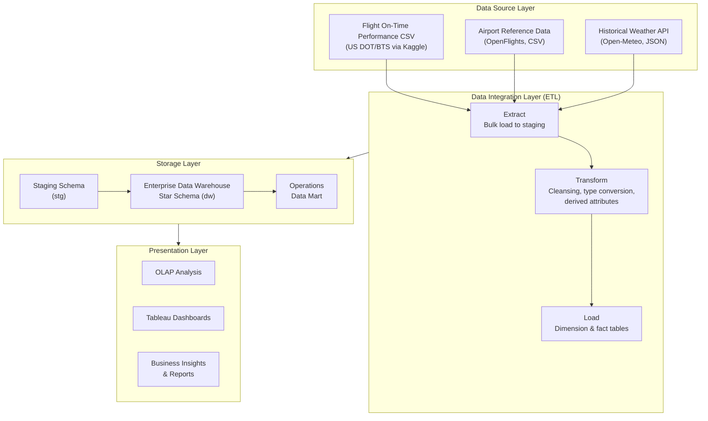
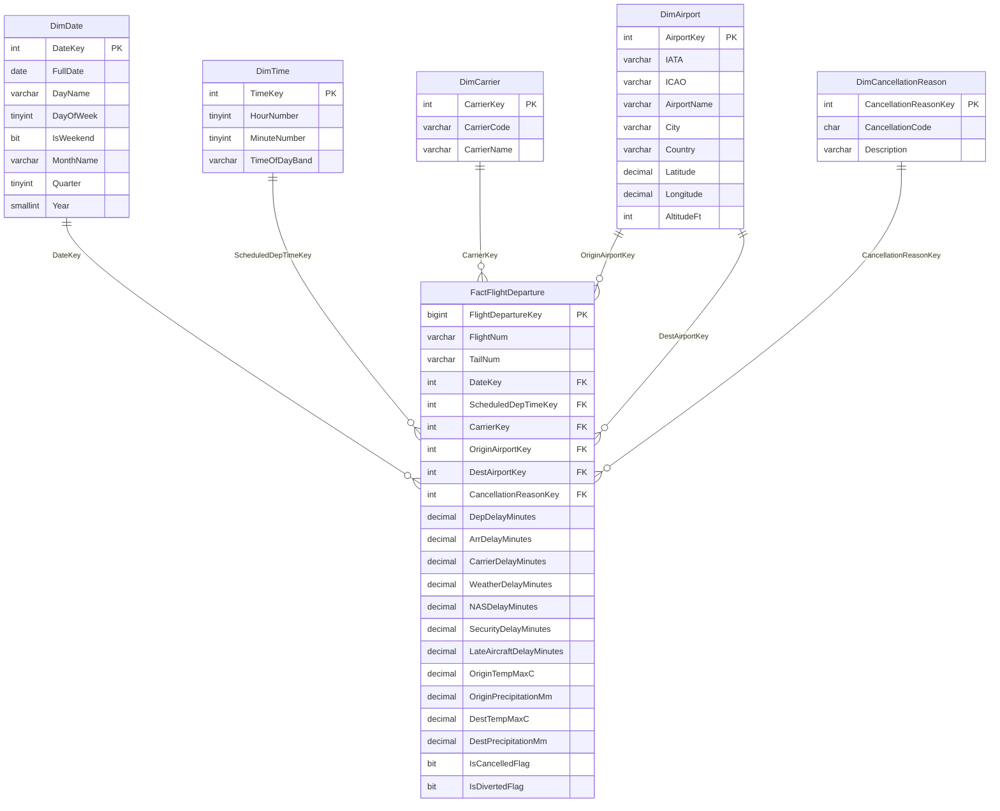
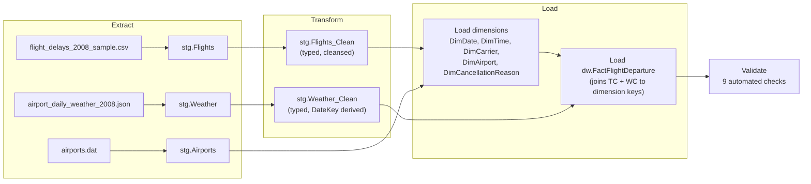

# IT3101 — Design and Implementation of a Data Warehouse and Business Intelligence Solution

**Business scenario:** Airline flight on-time performance and delay analysis (US domestic flights, 2008)
**Primary dataset:** [Airline Delay and Cancellation Data](https://www.kaggle.com/datasets/giovamata/airlinedelaycauses) (Kaggle, US DOT/BTS source), sampled to 200,000 records
**Stack:** Microsoft SQL Server (Azure SQL Edge, Docker) · T-SQL ETL · Tableau

> This document is the master report. Each task section below states, verbatim from the
> assignment brief, what must be documented — then provides that content. Sections not yet
> completed are marked **`[TODO]`**.
>
> **Note on project history:** this assignment originally used a ride-hailing (Uber-style)
> dataset. That work is preserved, not deleted, in `_archive_ride_hailing/`. The project was
> switched to flight delay data because the ride-hailing dataset only supported one genuinely
> independent real source (the booking transactions) — its other "sources" would have had to be
> reference data authored by the student. Flight data joins cleanly to multiple genuinely
> independent, real, third-party datasets on exact keys (IATA airport code, calendar date), which
> better satisfies Task 2's multiple-source requirement without any authenticity caveats.

---

## Task 1: Dataset Selection and Business Scenario Identification (10 Marks)

### Dataset Overview
*(brief requires: Business domain · Purpose of the system · Business problem addressed ·
Dataset source · Dataset format · Number of records · Attributes description)*

**Business domain:** Transportation — Aviation / Airline Operations.

**Purpose of the system:** The source is the US Bureau of Transportation Statistics (BTS)
On-Time Performance reporting system, which every US airline is legally required to report to.
It captures every scheduled domestic flight — its scheduled and actual departure/arrival times,
the airline and route flown, whether it was delayed, cancelled or diverted, and (for delayed
flights) how many minutes of the delay are attributable to each of five standard causes.

**Business owner / context:** this solution is built for an **Airline Operations Management**
function — the internal team at a carrier responsible for schedule reliability, resource
allocation, and disruption management. (An airport authority would frame the same delay data
around a different question — airport-level congestion management rather than a carrier's own
schedule design — so this project commits to the airline-operations framing throughout, rather
than treating the two as interchangeable.)

**Business problem addressed:** Airline operations management cannot easily tell, from raw
flight-level records alone, where its delay problem actually comes from: is a given route
chronically late because of the carrier's own scheduling, the destination airport's congestion
(NAS delay), the weather, or a knock-on effect from a late-arriving aircraft? These questions
require slicing millions of flight records simultaneously by carrier, route, airport, season and
external weather conditions — exactly the multi-dimensional analysis an OLTP-style reporting feed
is not built to answer directly, and exactly what a dimensional data warehouse and BI layer solve.

**Key stakeholders:**

| Stakeholder | Interest |
|---|---|
| Airline Operations Managers | Overall on-time performance and delay trends |
| Flight Scheduling Teams | Identifying problematic time periods, routes and airports to redesign schedules around |
| Airport Operations Teams | Airport-level congestion and operational delay patterns |
| Network Planning Teams | Route and airport performance for future network decisions |
| Management/Executives | High-level KPIs and operational trend summaries |

**Core KPIs monitored by this solution:**
1. On-Time Performance (%)
2. Average Arrival Delay (minutes)
3. Average Departure Delay (minutes)
4. Total Delay Minutes, and its breakdown by the 5 BTS delay causes
5. Cancellation Rate (%) and Diversion Rate (%)

**Key business questions this project answers** (these map directly to Task 7's dashboard and
Task 8's insights):
1. Which carriers have the highest/lowest on-time performance?
2. Which airports experience the greatest delays?
3. What are the major causes of flight delays?
4. How do delays vary by month, season and scheduled departure time?
5. What relationship exists between weather conditions and flight delays?

**Dataset source:**
- **Primary:** Kaggle, [Airline Delay and Cancellation Data](https://www.kaggle.com/datasets/giovamata/airlinedelaycauses)
  (`DelayedFlights.csv`), originally sourced from the US DOT/BTS On-Time Performance database.
- **Scope:** all US domestic flights, calendar year 2008.
- **Sampling:** the original file contains 1,936,758 flight records. For this assignment a
  **stratified random sample of 200,000 records was drawn, proportional by month** (so all 12
  months remain represented for trend analysis), using a fixed random seed (`random_state=42`)
  for reproducibility. This sampling decision and its method are documented here as a deliberate
  data-preparation step, not a data quality issue.

**Dataset format:** CSV, 1 header row + 1,936,758 data rows in the original file (200,000 after
sampling), ~248 MB uncompressed (original).

**Number of records:** 200,000 flight records (sampled from 1,936,758).

**Attributes description:**

| # | Column (source) | Description |
|---|---|---|
| 1 | Year, Month, DayofMonth, DayOfWeek | Flight date, decomposed |
| 2 | DepTime, CRSDepTime | Actual / scheduled departure time |
| 3 | ArrTime, CRSArrTime | Actual / scheduled arrival time |
| 4 | UniqueCarrier | Airline code (20 distinct carriers in the sample) |
| 5 | FlightNum | Carrier's flight number |
| 6 | TailNum | Aircraft registration (degenerate attribute) |
| 7 | ActualElapsedTime, CRSElapsedTime, AirTime | Actual/scheduled flight duration, and airborne time (minutes) |
| 8 | ArrDelay, DepDelay | Arrival / departure delay in minutes (negative = early) |
| 9 | Origin, Dest | Origin/destination airport IATA code (304 distinct airports) |
| 10 | Distance | Route distance in miles |
| 11 | TaxiIn, TaxiOut | Taxi time after landing / before takeoff (minutes) |
| 12 | Cancelled, CancellationCode | Cancellation flag and reason code |
| 13 | Diverted | Diversion flag |
| 14 | CarrierDelay, WeatherDelay, NASDelay, SecurityDelay, LateAircraftDelay | Minutes of arrival delay attributed to each of the 5 BTS-standard delay causes |

**Data quality characteristics identified during profiling:**
- `ArrTime`, `ActualElapsedTime`, `AirTime`, `ArrDelay`, `TaxiIn` are null only for the (rare)
  cancelled/diverted flights that never completed — a structural null, not missing data.
- The five delay-cause columns are null whenever `ArrDelay < 15` minutes — this is BTS's own
  reporting convention (cause breakdown is only recorded for flights the FAA classifies as
  delayed), not a data quality defect.
- `Cancelled` is rare in this sample (well under 1%), since the source file itself is titled
  "Delayed Flights" and is weighted toward flights that departed.

### Why this dataset is suitable for a DW/BI solution

| Requirement | How this dataset satisfies it |
|---|---|
| Represents an OLTP system | Each row is a single, timestamped flight-operations record from a real government reporting feed |
| Sufficient records for analytical processing | 200,000 sampled records (from a 1.94M population) across a full calendar year |
| Multiple attributes suitable for dimensional analysis | 29 source attributes map naturally to carrier, route/airport, date and delay-cause dimensions |
| Supports fact and dimension table creation | Clear measures (delay minutes by cause, distance, taxi/air time) at a well-defined grain (one row per flight) |
| Represents a realistic business scenario | Airline on-time performance is a genuine, well-understood operational problem with real decisions (scheduling, resourcing, weather contingency) that BI dashboards can meaningfully support |

### Limitations

Stated explicitly here so Task 8's conclusions are read against the right scope, not
over-generalised:

- **Historical scope:** the analysis is based on US domestic flight data from **2008**. Findings
  describe historical operational patterns within that year and should not be read as evidence of
  current airline performance.
- **Sampling:** the warehouse holds a stratified random sample of 200,000 flights out of the
  original 1,936,758 (≈10.3%). Monthly representation was preserved (see Task 1's sampling
  method), but conclusions are findings *from this sample*, not a claim about the complete
  1.94M-flight population.
- **Airport scope:** `DimAirport` holds the 304 airports actually referenced by the flight
  sample, not OpenFlights' full 7,698-airport catalogue (see Task 4, Design assumptions) — a
  deliberate scoping decision, not missing data.
- **Weather is a relationship, not a proven cause:** the data supports statements like "flights on
  higher-precipitation days show lower on-time performance," not "weather caused these delays" —
  other factors (airport congestion, late-aircraft cascades, carrier scheduling) are also present
  and are not fully separated out by a simple weather comparison.
- **Cancellations are too rare in this sample to be a primary conclusion:** only 57 of 200,000
  flights were cancelled for carrier/weather/NAS reasons combined (see Task 5 validation results).
  Cancellation rate is retained as a KPI, but the project's main analytical weight sits on delay
  and on-time performance, where the sample size is meaningful.

---

## Task 2: Data Source Identification and Preparation (10 Marks)

Three sources feed this warehouse. Unlike a single-file project, these are **three genuinely
independent, real, third-party-published datasets** — not one primary file plus authored
reference data — because flight records join to airport and weather data on exact standardised
keys (IATA code, calendar date) rather than free-text names.

### Documentation should include:

#### 1. Description of each data source

| Source | Represents | File |
|---|---|---|
| Flight On-Time Performance | US DOT/BTS's official flight delay reporting feed — every scheduled domestic flight's timing, routing and delay-cause breakdown | `data/raw/flight_delays_2008_sample.csv` |
| Airport Reference | OpenFlights' open, community-maintained global airport database | `data/sources/airports.dat` |
| Historical Weather | Open-Meteo's historical weather API (ERA5 reanalysis), queried per airport per day | `data/sources/airport_daily_weather_2008.json` |

#### 2. Source format

| Source | Format | Notes |
|---|---|---|
| Flight On-Time Performance | CSV | 200,000 rows (sampled from 1,936,758), 29 columns, UTF-8 |
| Airport Reference | CSV (no header row; documented column order) | 7,698 airports worldwide; downloaded directly from the [OpenFlights GitHub repository](https://github.com/jpatokal/openflights/blob/master/data/airports.dat) — a genuinely independent, publicly maintained dataset, not authored for this project |
| Historical Weather | JSON, fetched live via HTTP from a public API | 111,264 daily records (304 airports × 366 days — 2008 was a leap year); [Open-Meteo Historical Weather API](https://open-meteo.com/en/docs/historical-weather-api), free, no authentication required |

#### 3. Available attributes

| Source | Attributes |
|---|---|
| Flight On-Time Performance | Date fields, scheduled/actual departure & arrival times, carrier, flight number, tail number, elapsed/air time, arrival/departure delay, origin/dest airport, distance, taxi in/out, cancellation/diversion flags, 5 delay-cause columns (full list in Task 1) |
| Airport Reference | Airport ID, Name, City, Country, IATA code, ICAO code, Latitude, Longitude, Altitude, Timezone offset, DST, Timezone name, Type, Source |
| Historical Weather | IATA code, date, max/min temperature (°C), precipitation (mm), snowfall (cm), max wind speed (km/h) |

#### 4. Relationship between sources

- **Flight.Origin / Flight.Dest → Airport Reference.IATA** (exact string match). All 304 distinct
  airport codes appearing in the flight sample were verified to match an OpenFlights IATA code
  with **zero misses** — a clean 1:1 lookup, applied twice per flight (once per role: origin and
  destination), since the airport dimension is role-played in the fact table.
- **Flight.(Origin or Dest, flight date) → Historical Weather.(iata, date)** (exact match on
  airport code + calendar date). Weather was fetched specifically for the 304 airports and the
  exact 2008 date range present in the flight sample, so this join is complete by construction.
- The Airport Reference and Historical Weather sources are **conformed lookups** that enrich the
  flight fact's dimensions/measures — they do not introduce a second business process or fact
  table.

#### 5. Data preparation steps

| Source | Preparation steps |
|---|---|
| Flight On-Time Performance | Downloaded from Kaggle; original 1,936,758 rows stratified-sampled by month to 200,000 rows (`random_state=42` for reproducibility) to keep the warehouse and BI tool responsive while preserving full-year seasonal coverage; verified all 304 airport codes present resolve against the Airport Reference source |
| Airport Reference | Downloaded directly from OpenFlights' GitHub repository (`airports.dat`); no header row in the source file, so column names were assigned per OpenFlights' documented schema during load |
| Historical Weather | For each of the 304 airports actually used in the flight sample, one API call was made to Open-Meteo's historical archive endpoint covering that airport's full 2008 date range (rather than one call per day, which would have meant tens of thousands of requests); a small number of calls (12 of 304) were initially rate-limited (HTTP 429) and successfully retried with slower request pacing |

### Integrating data from different operational systems into a unified analytical environment

Each source originates from a **completely different real-world organisation** (a US government
statistics agency, a community-run open aviation database, and an independent weather-data
provider), each with its own format, update cadence and access method (bulk CSV download vs. a
static reference file vs. a live HTTP API). They are unified into one analytical environment
using the same staging-to-warehouse pattern regardless of origin:

1. **Land each source in its native shape.** Each gets its own staging table so that format
   differences (CSV vs. headerless CSV vs. JSON-over-HTTP) are resolved once, at load time.
2. **Resolve to standardised, exact-match business keys.** IATA airport codes and calendar dates
   are internationally standardised identifiers, so — unlike free-text names — no fuzzy matching,
   manual mapping or geocoding is required to join across sources; every join was verified to
   resolve completely during preparation.
3. **Merge into shared, conformed dimensions/measures.** The Transform/Load stage (Task 5) joins
   the flight data against both reference sources when populating the airport dimension (adding
   city/country/coordinates) and when enriching the fact table with same-day weather at the
   origin and destination airports.
4. **One query surface, three source systems.** Once loaded, a BI tool querying the warehouse
   never needs to know that airport metadata came from a static community file and weather came
   from a live API call made months after the flights occurred — the star schema presents one
   consistent, integrated view regardless of the originating system.

---

## Task 3: Data Warehouse Architecture Design (10 Marks)

### Students must provide:
- [x] Architecture diagram
- [x] Explanation of each component



**Explanation of each component:**

- **Data Source Layer.** Three independently-sourced inputs (see Task 2 for provenance): the
  primary flight transaction data (CSV), a static airport reference file (CSV), and a live weather
  API (JSON over HTTP). Each has a different format and access method, which is exactly why an
  integration layer is needed rather than querying them directly.
- **Data Integration Layer (ETL).** Implemented entirely in T-SQL (`sql/` folder). *Extract* bulk-
  loads each raw source into its own staging table unmodified. *Transform* applies cleansing, type
  casting, and derives new attributes (e.g. delay-cause proportions, weather-day flags). *Load*
  resolves business keys to dimension surrogate keys and inserts the fact table.
- **Storage Layer.** The `stg` schema holds raw and cleansed staging tables (a temporary working
  area, truncated and reloaded on each run). The `dw` schema holds the permanent star schema
  (dimensions + fact). A downstream **Operations Data Mart** (Task 6) will hold a filtered/
  aggregated subset for a specific user group.
- **Presentation Layer.** Tableau connects directly to the `dw`/data mart schema for OLAP-style
  slicing (drill-down/roll-up across date, carrier, airport), rendering the dashboards required by
  Task 7 and the business insights required by Task 8.

---

## Task 4: Dimensional Data Warehouse Design and Implementation (20 Marks)

Implemented in SQL Server (database `DWBI_FlightDelay`, schema `dw`) — DDL in
`sql/01_dimensions/01_create_dimensions.sql` and `sql/02_facts/01_create_fact.sql`. All 9 ETL
validation checks pass against the loaded data (see Task 5).

### Fact Table

**Business process:** Flight departure — a scheduled US domestic flight operated by a carrier
from an origin to a destination airport on a given date.

**Grain:** One row per flight record in the source sample (`dw.FactFlightDeparture`, 200,000
rows, surrogate key `FlightDepartureKey`).

**Measures:**

| Group | Measures |
|---|---|
| Schedule/operational performance | `ScheduledElapsedMinutes`, `ActualElapsedMinutes`, `AirTimeMinutes`, `DepDelayMinutes`, `ArrDelayMinutes`, `TaxiInMinutes`, `TaxiOutMinutes`, `DistanceMiles` |
| BTS delay-cause breakdown (minutes) | `CarrierDelayMinutes`, `WeatherDelayMinutes`, `NASDelayMinutes`, `SecurityDelayMinutes`, `LateAircraftDelayMinutes` |
| Same-day weather at origin airport | `OriginTempMaxC`, `OriginTempMinC`, `OriginPrecipitationMm`, `OriginWindSpeedMaxKmh` |
| Same-day weather at destination airport | `DestTempMaxC`, `DestTempMinC`, `DestPrecipitationMm`, `DestWindSpeedMaxKmh` |
| Flags | `IsCancelledFlag`, `IsDivertedFlag` |

**Foreign keys:** `DateKey`, `ScheduledDepTimeKey`, `CarrierKey`, `OriginAirportKey`,
`DestAirportKey`, `CancellationReasonKey`.

**Degenerate dimensions** (kept directly on the fact, not worth a separate table): `FlightNum`,
`TailNum`.

### Dimension Tables

| Dimension | Grain / row count | Hierarchy |
|---|---|---|
| `DimDate` | Full 2008 calendar (366 rows — 2008 was a leap year) | Date → Month → Quarter → Year |
| `DimTime` | Every minute of day (1,440 rows), used for scheduled departure time | Time → Hour → Time-of-day band |
| `DimCarrier` | 20 airlines, real BTS carrier codes (Task 2) | — |
| `DimAirport` | 304 airports actually used in the flight data, role-played as Origin and Destination, enriched from OpenFlights (Task 2) | Airport → City → Country |
| `DimCancellationReason` | 5 rows: BTS standard codes N/A/B/C/D | — |

Schema type: **Star schema** (no snowflaking was needed this time, since airport city/country are
simple attributes rather than a separate normalised table).

### Documentation should include:

#### Schema diagram



#### Table descriptions

- **`dw.FactFlightDeparture`** — the central fact table. One row per flight; carries all
  performance and delay-cause measures plus same-day weather at both endpoints. Every dimension
  join is `NOT NULL` (no unknown/missing members needed, since every flight in this dataset has a
  determinate date, time, carrier, origin, destination and cancellation status — even
  "not cancelled" resolves to a real `DimCancellationReason` row, code `N`).
- **`dw.DimDate`** — one row per calendar day for all of 2008, not only days that appear in the
  flight sample, so the warehouse supports future data at no rebuild cost.
- **`dw.DimTime`** — one row per minute of the day (1,440 rows), used to bucket each flight's
  *scheduled* departure time into an hour and a time-of-day band. Actual departure isn't dimensioned
  separately, since delay minutes already capture the deviation from schedule.
- **`dw.DimCarrier`** — one row per airline. `CarrierName` was resolved from the raw `UniqueCarrier`
  code using the real, publicly documented BTS/IATA carrier code registry for 2008 (see Task 2 /
  Design assumptions) — not invented.
- **`dw.DimAirport`** — one row per airport actually referenced as an origin or destination in the
  flight sample (304 of OpenFlights' 7,698 total airports). Role-played twice in the fact table via
  `OriginAirportKey` and `DestAirportKey`.
- **`dw.DimCancellationReason`** — one row per BTS cancellation code, including `N` for
  "not cancelled" so the fact table's `CancellationReasonKey` is never NULL.

#### Design assumptions

- **`DimCarrier.CarrierName`** was resolved from `UniqueCarrier` using the real 2008 BTS/IATA
  carrier code registry (e.g. `WN` → Southwest Airlines, `DL` → Delta Air Lines) — this is public,
  checkable historical information, not authored/invented data (see Task 2).
- **`DimCancellationReason`** uses the BTS standard cancellation code convention (`A`=Carrier,
  `B`=Weather, `C`=National Air System, `D`=Security). This particular source file also encodes
  "not cancelled" as `N` rather than leaving the field blank — a documented quirk of this specific
  Kaggle export, handled by giving `N` its own dimension row rather than treating it as missing data.
- **Weather is modelled as measures on the fact table, not a separate dimension or fact.**
  Temperature/precipitation/wind are continuous numeric values, not descriptive attributes, and
  keeping flight-grain and daily-weather-grain in one table avoids a fan trap that a separate
  weather fact (at airport-day grain) would introduce when joined to flight-grain data. Both origin
  and destination weather are captured, since either can plausibly explain a flight's `WeatherDelay`.
- **`DimAirport` is scoped to the 304 airports actually used**, rather than importing all 7,698
  OpenFlights airports, to keep the dimension table's members all meaningfully queryable against
  the fact table.
- **`FlightNum` and `TailNum` are degenerate dimensions** (kept as plain attributes on the fact
  table) rather than given their own dimension tables, since they carry no descriptive attributes
  beyond the identifier itself.

### Primary keys, foreign keys, relationships and hierarchies

| Table | Primary key | Foreign keys (→ references) | Hierarchy |
|---|---|---|---|
| `dw.DimDate` | `DateKey` | — | Date → Month → Quarter → Year |
| `dw.DimTime` | `TimeKey` | — | Time → Hour → Time-of-day band |
| `dw.DimCarrier` | `CarrierKey` | — | — |
| `dw.DimAirport` | `AirportKey` | — | Airport → City → Country |
| `dw.DimCancellationReason` | `CancellationReasonKey` | — | — |
| `dw.FactFlightDeparture` | `FlightDepartureKey` | `DateKey` → `DimDate`; `ScheduledDepTimeKey` → `DimTime`; `CarrierKey` → `DimCarrier`; `OriginAirportKey` → `DimAirport`; `DestAirportKey` → `DimAirport`; `CancellationReasonKey` → `DimCancellationReason` | — (fact table; relationships listed under Foreign keys) |

**Relationships:** all five dimension relationships are **one-to-many** (one date/time/carrier/
airport/cancellation-reason relates to many flights) — the standard star-schema pattern. Two of
the six foreign keys (`OriginAirportKey`, `DestAirportKey`) reference the **same** `DimAirport`
table — this is **role-playing**, one physical dimension serving two logical roles in the fact
table (a flight's origin and its destination are both "an airport," described identically).

---

## Task 5: ETL Process Development (20 Marks)

Fully implemented in T-SQL. All scripts live under `sql/`, and the entire pipeline can be rebuilt
from scratch at any time by running `./run_pipeline.sh`, which executes every script below in
order against the `DWBI_FlightDelay` database.

### ETL workflow



**Orchestration (`run_pipeline.sh`):**
1. Copy the three raw source files into the SQL Server container's filesystem (`docker cp`)
2. `sql/00_staging/01_create_staging.sql` — create staging tables (one per source) and the `DWBI_FlightDelay` database if it doesn't exist
3. `sql/01_dimensions/01_create_dimensions.sql` — create dimension tables
4. `sql/02_facts/01_create_fact.sql` — create the fact table (depends on dimensions existing first, for its foreign key constraints)
5. `sql/00_staging/02_load_staging.sql` — **Extract**: bulk-load all three sources into staging, unmodified
6. `sql/03_etl/01_transform_clean.sql` — **Transform**: clean and type the flight data
7. `sql/03_etl/02_load_dimensions.sql` — **Load**: populate all 5 dimensions
8. `sql/03_etl/03_load_fact.sql` — **Load**: clean/type the weather data, then populate the fact table
9. `sql/03_etl/04_validate.sql` — **Validate**: run all 9 automated checks

### Extract
*(document: Extraction method · Source connection · Data extraction process)*

| Source | Extraction method | Source connection | Process |
|---|---|---|---|
| Flight On-Time Performance | Bulk file load (`BULK INSERT`) | File-based; CSV copied into the SQL Server container's filesystem via `docker cp` | `FORMAT='CSV'`, `FIRSTROW=2` (skip header) — landed as-is into `stg.Flights`, every column `VARCHAR`, zero transformation |
| Airport Reference | Bulk file load (`BULK INSERT`) | File-based; `.dat` file (CSV format, no header) copied into the container | `FIRSTROW=1` (no header row to skip) — landed into `stg.Airports` |
| Historical Weather | Native JSON parse (`OPENROWSET` + `OPENJSON`) | File-based; JSON file (already fetched from the Open-Meteo API — see Task 2) copied into the container | `OPENROWSET(BULK ..., SINGLE_CLOB)` reads the whole file as one JSON document, `OPENJSON('$.records')` shreds the nested array into rows — landed into `stg.Weather` |

Result: 200,000 flight rows, 7,698 airport rows, 111,264 weather rows landed with zero data loss.

### Transform

Performed in `sql/03_etl/01_transform_clean.sql` (flights) and inline in `sql/03_etl/03_load_fact.sql`
(weather), producing `stg.Flights_Clean` and `stg.Weather_Clean`:

| Issue found | Transformation applied |
|---|---|
| Every column landed as text | `TRY_CAST` to `SMALLINT`/`TINYINT`/`INT`/`DECIMAL`/`BIT` as appropriate |
| Missing numeric values are empty strings, not `NULL` | `NULLIF(column, '')` → real SQL `NULL` |
| Delay-cause columns null when `ArrDelay < 15` | **Left as NULL** — this is BTS's own reporting convention (cause is only recorded for flights classified as delayed), not a defect; verified by validation check 8 |
| No derived join key for scheduled departure time | Derived `ScheduledDepTimeKey` (HHMM) from `CRSDepTime` for the `DimTime` join |
| No derived join key for calendar date | Derived `DateKey` (YYYYMMDD) from `Year`/`Month`/`DayOfMonth` |
| Weather dates arrive as `YYYY-MM-DD` strings | `REPLACE(WeatherDate, '-', '')` + `CAST` to `INT` to match the `DateKey` format used everywhere else |
| OpenFlights encodes missing values as the literal string `\N` | `NULLIF(ICAO, '\N')` applied when loading `DimAirport` |

### Load

Executed by `sql/03_etl/02_load_dimensions.sql` then `sql/03_etl/03_load_fact.sql`:

1. **Dimensions loaded first** (enforced by the fact table's foreign key constraints, which would
   reject the load otherwise): `DimDate` and `DimTime` are generated programmatically (full 2008
   calendar and full 1,440-minute day); `DimCarrier` resolves real airline names from the BTS
   carrier code registry; `DimAirport` is populated by joining the distinct origin/destination
   codes actually used against `stg.Airports`; `DimCancellationReason` is a fixed 5-row reference
   list (BTS standard codes).
2. **Fact table loaded second**, via inner joins from `stg.Flights_Clean` to every dimension
   (resolving business keys to surrogate keys) plus two **left** joins to `stg.Weather_Clean` — one
   for origin airport/date, one for destination airport/date — since weather, unlike the other five
   dimensions, is not guaranteed a priori to have 100% coverage (it happened to reach 100% in
   practice; the left join is a defensive design choice, not a sign of missing data).

### Validation results

9 automated checks in `sql/03_etl/04_validate.sql`, **all passing**:

| # | Check | Result |
|---|---|---|
| 1 | Row count: raw staging = clean staging | PASS |
| 2 | Row count: clean staging = fact table | PASS |
| 3 | No orphan foreign keys (all 6 dimension joins resolve) | PASS |
| 4 | All 304 flight airport codes resolved in `DimAirport` | PASS |
| 5 | No failed type conversions on key numeric fields | PASS |
| 6 | Total distance reconciles: staging vs fact | PASS |
| 7 | Weather populated for essentially all fact rows (origin) | PASS — in fact, 100% (0 of 200,000 rows missing origin or destination weather) |
| 8 | Delay-cause minutes only present when `ArrDelay >= 15` (BTS convention preserved) | PASS |
| 9 | Cancelled/Diverted flags are 0 or 1 only | PASS |

Additional facts confirmed during validation (useful for Task 8):
- 70,845 of 200,000 flights (35.4%) have no delay-cause breakdown, i.e. arrived with under 15
  minutes of delay or early — consistent with BTS's reporting threshold.
- Cancellation breakdown: 199,943 not cancelled, 26 weather-cancelled, 25 carrier-cancelled,
  6 cancelled for National Air System reasons (no security cancellations in this sample).

---

## Task 6: Data Mart Development (10 Marks)

Implemented as a **dependent data mart** — sourced entirely from the EDW (`dw` schema) rather than
built from raw sources independently, and reusing the same conformed dimension keys (`DateKey`,
`CarrierKey`, `OriginAirportKey`) rather than duplicating dimension tables. DDL and load script:
`sql/04_datamart/01_create_datamart.sql`, `sql/04_datamart/02_load_datamart.sql`.

**Name:** Operations & Delay Performance Data Mart (`mart.FactDailyCarrierAirportPerformance`)
**Grain:** one row per (Date, Carrier, Origin Airport) combination — an aggregation of the EDW's
flight-level grain, 93,729 rows (from 200,000 flight-level rows in the EDW).

### Students must explain:

#### Purpose of the data mart

The EDW's fact table is at flight grain — exactly what's needed for deep, ad-hoc analysis, but
impractical as the *starting* view for someone who needs a daily operational read on "how are we
doing." This data mart pre-aggregates every flight into one row per **carrier, origin airport and
day**, with the key operational KPIs already computed: on-time rate, average delay by cause, and
average same-day weather at that airport. Its purpose is to give operations staff a fast,
purpose-built summary table that answers their recurring questions directly, without every
dashboard query having to re-run a `GROUP BY` over the full 200,000-row fact table.

#### Target users

**Airline and airport operations managers** — the people responsible for day-to-day schedule
reliability and weather-contingency planning at a given carrier or hub airport. They need to
quickly see, for example, "which days/airports/carriers had poor on-time performance, and was
weather a factor?" rather than analysing individual flight records. This is distinct from, say, a
finance team (who would want a cost/revenue-oriented mart) or a customer-experience team (who
would want a passenger-complaint-oriented mart) — this mart is scoped specifically to the
operational delay/weather question this project focuses on.

#### Analytical benefits

- **Faster queries.** 93,729 pre-aggregated rows instead of scanning and grouping 200,000
  flight-level rows on every dashboard refresh — a meaningful reduction, and the aggregation logic
  (on-time rate calculation, per-cause averages) only has to be computed once, at load time, not
  recomputed by every report.
- **KPIs computed once, used everywhere.** `OnTimeRatePct` and the five `Avg*DelayMinutes` columns
  are ready-made measures — a BI tool can chart them directly with no calculated fields required,
  reducing the chance of different dashboards defining "on-time rate" inconsistently.
- **Weather correlation is immediately visible at the right grain.** Because weather is averaged
  per airport-day alongside delay KPIs, patterns like "Delta's Atlanta flights on 2008-10-24
  averaged 26.1mm of rain and only a 17.78% on-time rate" are visible directly from a single mart
  row — no join back to the EDW's flight-level weather columns required for this level of analysis.
- **Still traceable to detail.** Because the mart reuses the EDW's exact dimension keys rather than
  its own copies, an analyst who spots something interesting in the mart can join back to
  `dw.FactFlightDeparture` on those same keys to drill into individual flights — the mart doesn't
  become a dead end.

---

## Task 7: OLAP Analysis and Business Intelligence Dashboard Development (15 Marks)

**Tool: Power BI Desktop**, running on a Windows VM (Power BI Desktop is Windows-only; the
warehouse itself runs in Docker on the host Mac, reached over the local network — see connection
notes at the end of this section). Connects live to `DWBI_FlightDelay` via the two presentation
views built in `sql/05_presentation/01_create_views.sql`: `dw.vw_FlightDetail` (flight grain, for
drill-down) and `mart.vw_DailyCarrierAirportPerformance` (pre-aggregated, for KPIs/trends).

The dashboard goes beyond the brief's 3-page minimum with a 4th "Deep Dive" page, added
specifically to make the tool genuinely explorable rather than a fixed set of static charts.

### Base measures (DAX, defined on `mart vw_DailyCarrierAirportPerformance`)

```dax
Total Flights = SUM('mart vw_DailyCarrierAirportPerformance'[FlightCount])
Total Cancelled = SUM('mart vw_DailyCarrierAirportPerformance'[CancelledCount])
Total Diverted = SUM('mart vw_DailyCarrierAirportPerformance'[DivertedCount])

Overall On-Time Rate = DIVIDE(
    SUMX('mart vw_DailyCarrierAirportPerformance', [OnTimeRatePct] * [FlightCount]),
    SUM('mart vw_DailyCarrierAirportPerformance'[FlightCount]))

Avg Arrival Delay = DIVIDE(
    SUMX('mart vw_DailyCarrierAirportPerformance', [AvgArrDelayMinutes] * [FlightCount]),
    SUM('mart vw_DailyCarrierAirportPerformance'[FlightCount]))

Avg Departure Delay = DIVIDE(
    SUMX('mart vw_DailyCarrierAirportPerformance', [AvgDepDelayMinutes] * [FlightCount]),
    SUM('mart vw_DailyCarrierAirportPerformance'[FlightCount]))

Avg NAS Delay = DIVIDE(
    SUMX('mart vw_DailyCarrierAirportPerformance', [AvgNASDelayMinutes] * [FlightCount]),
    SUM('mart vw_DailyCarrierAirportPerformance'[FlightCount]))

Cancellation Rate % = DIVIDE([Total Cancelled], [Total Flights]) * 100
Diversion Rate % = DIVIDE([Total Diverted], [Total Flights]) * 100
```

All weighted-average measures use `SUMX(... * FlightCount) / SUM(FlightCount)` rather than a plain
`AVERAGE`, since each mart row already represents a different number of flights — a naive average
would treat a low-volume day the same as a high-volume one.

### Report Page 1: Executive Summary
- [x] KPIs
- [x] Summary cards
- [x] Overall performance indicators

**8 Card visuals:** `Total Flights`, `Overall On-Time Rate`, `Avg Arrival Delay`,
`Avg Departure Delay`, `Total Cancelled`, `Cancellation Rate %`, `Total Diverted`,
`Diversion Rate %`.

**1 Donut chart:** the five `Avg*DelayMinutes` cause measures (Carrier/Weather/NAS/
Security/LateAircraft, all Average aggregation) — gives the delay-cause split (Insight 1) a
permanent home on the summary page rather than requiring a drill into Page 2.

### Report Page 2: Trend Analysis
- [x] Time-based analysis
- [x] Line charts
- [x] Comparison charts

1. **Line chart** — X: `FullDate`, Y: `AvgArrDelayMinutes` (Average), Legend: `CarrierName`
2. **Line chart** — X: `FullDate`, Y: `OnTimeRatePct` (Average)
3. **Clustered bar chart** — the five delay-cause measures side by side
4. **Bar chart** — X: `TimeOfDayBand` (from `dw vw_FlightDetail`), Y: `ArrDelayMinutes` (Average) — evidence for Insight 4
5. **Bar chart** — X: `MonthName` (sorted by `MonthNumber`), Y: `AvgArrDelayMinutes` (Average) — evidence for Insight 5

### Report Page 3: Interactive Analysis
- [x] Filters, Slicers, Drill-down, Roll-up

Source: `dw vw_FlightDetail` (flight grain, so drill-down has somewhere to go).

1. **Date hierarchy**: `Year` → `Quarter` → `MonthName` → `FullDate`, built via right-click → Create hierarchy
2. **Clustered column chart** — X: the date hierarchy, Y: `ArrDelayMinutes` (Average); the visual's native ∧/⌄ controls provide drill-down and roll-up
3. **Map visual** — Location: `OriginCity`, Size/Color: `ArrDelayMinutes` (Average) — geographic view of Insight 6
4. **3 Slicers** — `CarrierName`, `OriginCity`, `MonthName`

### Report Page 4: Deep Dive Analysis (beyond the brief's minimum)

Added specifically to make the dashboard an exploratory analysis tool rather than a fixed set of
charts — this is where cross-filtering, drill-through and scenario comparison live.

1. **Heatmap matrix** — Rows: `CarrierName`, Columns: `MonthName` (sorted by `MonthNumber`),
   Values: `AvgArrDelayMinutes` (Average), with conditional-formatting background color scale.
   Surfaces ~240 carrier/month combinations in one glance — carrier-specific seasonal problems
   (e.g. a carrier that's fine most months but bad in December) are invisible in the Page 2
   line/bar charts but immediately visible here.
2. **Bubble chart** — X: `AvgNASDelayMinutes` (Average), Y: `OnTimeRatePct` (Average), Size:
   `FlightCount` (Sum), Details: `OriginCity` — one bubble per city; makes the hub-airport
   congestion landscape (Insight 6) explorable rather than a static ranked list.
3. **Scatter chart** — X: `AvgOriginPrecipitationMm` (Average), Y: `AvgArrDelayMinutes` (Average),
   Details: `FullDate` — one point per day; visualises the weather/delay relationship behind
   Insight 2 as a trend rather than two summary numbers.
4. **Drill-through page** ("Carrier Detail") — a separate page with drill-through enabled on
   `CarrierName`, containing a flight-level table from `dw vw_FlightDetail`. Right-clicking any
   carrier anywhere in the report jumps to every individual flight for that carrier.
5. **Bookmark toggle** — a `DayType` calculated column (`Rain/Snow Day` vs `Dry Day`, based on
   `OriginPrecipitationMm > 0`) drives two bookmarked states ("Rainy Days" / "Dry Days") wired to
   button visuals, so a viewer can click between the two and watch every KPI and chart on the page
   update live — turning Insight 2 into something the viewer discovers interactively rather than
   being told as a static figure.

### Connecting Power BI to the warehouse

The warehouse runs in a Docker container (`dwbi-sqlserver`, Azure SQL Edge) on the development
Mac; Power BI Desktop runs on a separate Windows VM and connects over the local network — **Get
Data → SQL Server**, server `<Mac's LAN IP>,1433` (or `<Mac's mDNS hostname>.local,1433`, which
survives network changes), SQL Server authentication (`sa` / see `run_pipeline.sh`). Note: SQL
Server prefixes the schema name to each view when Power BI loads it, so `dw.vw_FlightDetail`
appears in the Fields pane as **`dw vw_FlightDetail`** and `mart.vw_DailyCarrierAirportPerformance`
as **`mart vw_DailyCarrierAirportPerformance`** (space, not dot) — all DAX above uses the correct
loaded names.

---

## Task 8: Business Insights and Recommendations (5 Marks)

Six insights, each derived directly from queries against the warehouse (`dw.FactFlightDeparture`)
and reproducible on the Trend Analysis / Interactive Analysis dashboard pages built in Task 7.

### 1. Late-arriving aircraft, not weather, is the single biggest driver of delay

Across all 200,000 flights, total delay minutes break down as: **Late Aircraft 40.1%**, Carrier
30.2%, National Air System (NAS) 23.8%, Weather 5.9%, Security 0.1%. The largest cause is a
*cascading* one — a late-arriving aircraft delays its next scheduled departure — not an external
factor like weather.

**Recommendation:** invest in schedule buffer time and aircraft-rotation resilience (e.g. shorter
turnaround chains, spare aircraft at high-traffic hubs) rather than assuming weather mitigation
alone will fix on-time performance — the data shows weather is a comparatively small direct cause.

### 2. Poor weather is associated with materially worse performance than the official 5.9% delay-cause share suggests

Comparing flights by same-day origin precipitation: on **rainy/snow days**, average arrival delay
is **50.2 minutes** vs **35.2 minutes on dry days** (a 43% increase), on-time rate drops from
**42.1% to 30.9%**, and the cancellation rate more than doubles (0.016% → 0.041%). Weather is only
officially coded as the delay *cause* 5.9% of the time — this comparison shows a clear
*relationship* between poor weather and worse outcomes, though the official cause breakdown
suggests part of that relationship is likely mediated through knock-on Late Aircraft and NAS
delays rather than weather being coded as the direct cause. This is a correlational finding, not
a controlled causal test — other factors (season, route mix) are not held constant here.

**Recommendation:** weather-contingency planning (proactive rebooking, buffer scheduling on
forecast-bad-weather days) should be sized against this broader *relationship*, not just the
narrow "Weather" cause-code figure — relying on the official cause breakdown alone likely
understates the business case for weather mitigation investment.

### 3. Carrier performance varies substantially — some carriers need scheduling review

Among carriers with over 1,000 flights in the sample, **JetBlue Airways** (55.9 min avg arrival
delay, 30.5% on-time), **Mesa Airlines** (54.9 min, 26.1% on-time) and **Comair** (52.3 min, 26.5%
on-time) perform far worse than the fleet average, while low-volume carriers like Southwest and
Alaska Airlines (see Task 4/5 validation figures) run well ahead of them.

**Recommendation:** carriers at the bottom of this ranking warrant an internal scheduling audit —
whether their published block times are unrealistic, or their aircraft utilization leaves too
little slack — since this is a controllable factor, unlike weather or airspace congestion.

### 4. Evening flights are the most delayed time-of-day band

Average arrival delay by scheduled departure time-of-day: **Evening 46.3 min**, Afternoon 42.5
min, Morning 38.0 min, **Night 37.3 min** (lowest). Delay visibly compounds through the day as
aircraft rotation delays accumulate — directly consistent with Insight 1.

**Recommendation:** morning departures should be prioritized/protected in scheduling where
possible, since a delayed early flight has the whole day to cascade; evening schedules should
carry extra buffer time by design, not be padded reactively.

### 5. December is the worst month for delays; September/October are the best

Average arrival delay by month: **December 50.2 min** (worst), July 46.7 min, June 46.3 min,
February 46.0 min, vs **October 31.2 min** and **September 34.9 min** (best). This lines up with
holiday travel volume and winter weather in December, and the post-summer/pre-holiday lull in
September–October.

**Recommendation:** capacity planning (ground crew staffing, de-icing resources, gate allocation)
should be weighted toward December and mid-summer, and airlines should consider more conservative
published schedules for December specifically, where a 50-minute average delay suggests current
schedules are already unrealistic for that month's actual operating conditions.

### 6. Chicago O'Hare underperforms its peer hubs despite comparable congestion delay

Among the 8 busiest origin airports, **Chicago O'Hare (ORD)** has the worst on-time rate
(**28.5%**) despite an average NAS (air-system congestion) delay of 13.1 minutes — similar to
Atlanta (12.9 min, 35.4% on-time) and Dallas-Fort Worth (11.3 min, 36.6% on-time). Phoenix and Las
Vegas, by contrast, combine low NAS delay (8.6–8.8 min) with the best on-time rates (44.9–45.8%)
of the group.

**Recommendation:** ORD's underperformance relative to airports with similar congestion levels
points to airport-specific operational factors (gate/taxiway layout, ground handling capacity)
rather than airspace congestion alone — worth a dedicated operational review rather than treating
it as "just a busy hub."

### How these insights support business decision-making

Each insight ties a specific, quantified pattern to an actionable lever an airline or airport
operator actually controls: schedule buffer design (1, 4), weather-contingency budget sizing (2),
which carriers need operational audits (3), seasonal staffing/capacity planning (5), and where to
target airport-specific process improvement (6). None of these conclusions could be reached from
the raw OLTP-style flight log alone — they all require the multi-dimensional slicing (by cause,
by carrier, by time-of-day, by month, by airport) that the star schema and dashboard were built to
provide.

---

## Usage of AI

**`[TODO]`** — brief requires acknowledging AI tool use. Draft note to adapt:

> AI (Claude) was used as a supporting tool throughout this project for: brainstorming and
> evaluating candidate business scenarios and datasets, writing data-fetching/profiling scripts
> (subsequently reviewed and run by the student), drafting SQL DDL/ETL scripts, and structuring
> this report. All design decisions (dataset choice, sampling method, schema grain, dimension
> choices) were reviewed and understood by the student before inclusion. Data provenance was
> independently verified — the airport and weather sources are real, third-party-published
> datasets (OpenFlights and Open-Meteo respectively), not AI-fabricated data, and join integrity
> (zero unmatched keys) was checked programmatically rather than assumed.
